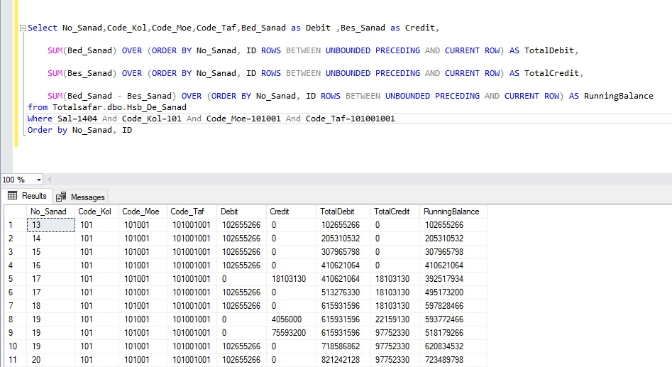

# High-Performance Running Balance in T-SQL

This repository demonstrates a deterministic and efficient approach to calculating running balances in SQL Server using `SUM() OVER()` and window frames.

## Overview

In financial systems, running balance calculations must be both **accurate** and **deterministic**, especially when multiple transactions share the same timestamp or document number.

This project shows how to solve that problem without cursors, loops, or self-joins.

## Problem Statement

Traditional RBAR approaches such as cursors or row-by-row loops are slow and do not scale well.

The challenge becomes more subtle when:
- multiple rows have the same `No_Sanad`
- ordering must remain stable
- balance calculation must remain reproducible

## Solution

The query uses:

- `SUM(...) OVER (...)` for set-based aggregation
- `ROWS BETWEEN UNBOUNDED PRECEDING AND CURRENT ROW` for precise running accumulation
- `ORDER BY No_Sanad, ID` to guarantee deterministic ordering

## Key Technical Decisions

### 1. Deterministic Sorting
Using `No_Sanad` alone is not enough when duplicate values exist.  
Adding `ID` ensures that row order is stable and predictable.

### 2. ROWS vs RANGE
`ROWS` calculates the running balance row by row.  
`RANGE` can group peer rows with the same sort key, which may produce incorrect results in this scenario.

### 3. Set-Based Processing
This approach leverages SQL Server's optimized execution engine and avoids RBAR patterns.

## Files

- `Query.sql` — Main query implementation
- `README.md` — Documentation
- `RunningTotal_total.jpg` — Screenshot of the result

## Usage

1. Create the sample table and data.
2. Run `Query.sql`.
3. Compare the output with the screenshot.

## Result

## Notes

This project focuses on correctness and readability first.  
A future enhancement could include performance benchmarking on larger datasets.

## Author

Armin
